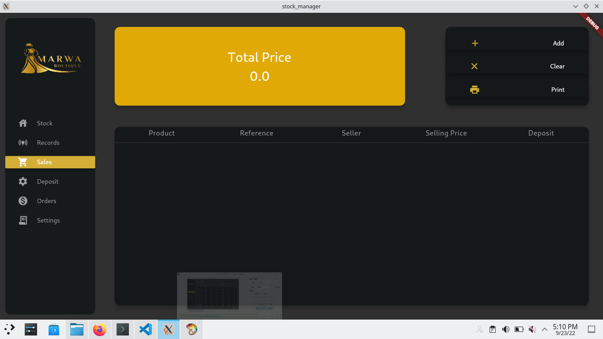

## Note
    The build folder is not included which would cause some errors in your ide after cloning for the first time execute flutter run or flutter pub get to fix the issues.

    Provide your own secrets.dart with the following values
        - websocketLink
        - authHeader
        - serverLink

